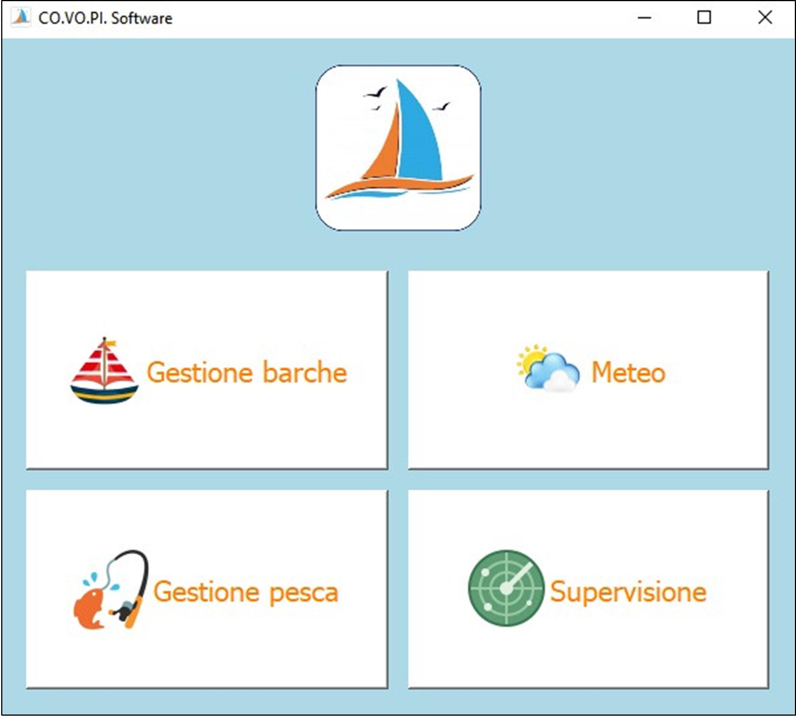

<h1 align="center">CO.VO.PI Software</h1>

Python application developed for the Consorzio Vongole del Piceno to manage daily clam-fishing operations.
The system handles vessel data, daily quotas, GPS supervision, weather monitoring and automated communication via WhatsApp Web.

<h3>Figure 1: Main Application View</h3>

<h2 align="center">Warning</h2>

Before starting the software, please read the guide.txt file in the configuration folder.

<h2 align="center">Authors</h2>

Di seguito sono riportati gli autori del progetto:

* Michele Vigliotta
* Filippo Montagnoli
* Erika Pignotti

