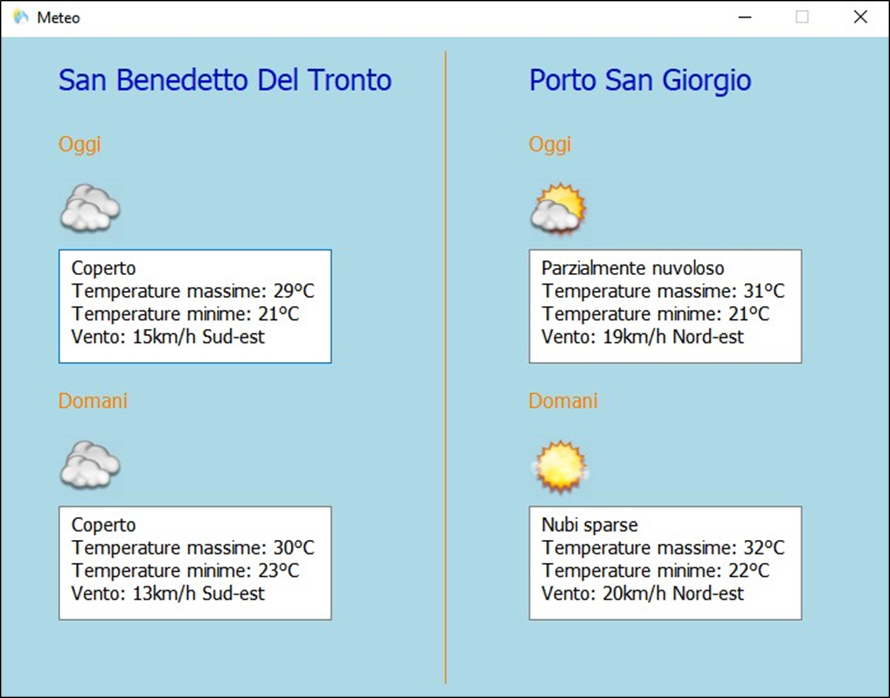

<h1 align="center">CO.VO.PI Software</h1>

  
  
  

Python Desktop application for <i>Consorzio Vongole del Piceno</i> to manage daily clam-fishing operations, vessel tracking, and automated crew communication.

  
<h2>Warnings</h2>

Before starting the software, please read the <code>guide.txt</code> file in the configuration folder.

<h2>Features</h2>

  - <b>Fishing Management</b>: insert total requested sacks, automatic quota calculation, green/red fishing permission indicator, WhatsApp Web message automation
  - <b>Vessel Management</b>: add/remove vessels, view details (name, license, crew, responsible person)
  - <b>GPS Supervision</b>: real-time vessel tracking, detection of restricted-area violations, early/late port exit alerts
  - <b>Weather Monitoring</b>: real-time weather for San Benedetto del Tronto and Porto San Giorgio using Tutiempo API
  - <b>Secure Access</b>: login with username and password

<h3 align="center">Example: Weather View</h3>

<h2>Tech Stack</h2>

  - <b>Python 3, PyQt5 (GUI)</b>
  - <b>JSON (weather and gps data)</b>
  - <b>requests (weather API)</b>
  - <b>pywhatkit + WhatsApp Web automation</b>
  - <b>MVC architecture</b>
  - <b>Unit tests with unittest</b>

<h2>Documentation</h2>

Full technical documentation:
<code>/docs/RelazioneProgetto.pdf</code>

<h2>Authors</h2>

* Michele Vigliotta
* Filippo Montagnoli
* Erika Pignotti

